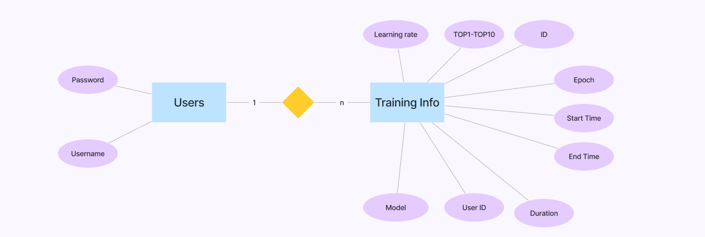

# web软件设计

## web 流程图设计

## 数据库设计

基于提供的数据库脚本，以下是对应的ER（实体-关系）图的描述：

### 实体和属性

1. **用户（Users）**

**ID**：用户的唯一标识符，主键，自增。

**用户名（Username）**：用户的名称，唯一。

**密码（Password）**：用户的密码。

2. **训练信息（Training Info）**

**ID**：训练信息的唯一标识符，主键，自增。

**Epoch**：训练的轮次。

**开始时间（Start Time）**：训练开始的时间。

**结束时间（End Time）**：训练结束的时间。

**累计用时（Duration）**：训练的总用时，单位秒。

**用户ID（User ID）**：进行训练的用户的ID。

**模型（Model）**：使用的模型。

**top1-top10**：精准度

### ER图

