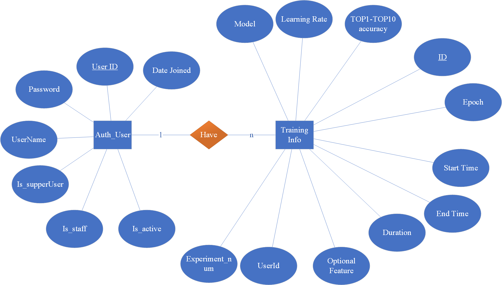

## web软件设计（vue-django）

可访问地址https://project.lijianye.work

因服务器上没有显卡 在线网站只演示前端部分 不展示模型训练和模型预测  但是部署到本地可以实现这些功能

### web 流程图设计


### 数据库设计

基于提供的数据库脚本，以下是对应的ER（实体-关系）图的描述：

实体和属性

1. **用户（Users）**

**ID**：用户的唯一标识符，主键，自增。

**用户名（Username）**：用户的名称，唯一。

**密码（Password）**：用户的密码。

2. **训练信息（Training Info）**

**ID**：训练信息的唯一标识符，主键，自增。

**Epoch**：训练的轮次。

**开始时间（Start Time）**：训练开始的时间。

**结束时间（End Time）**：训练结束的时间。

**累计用时（Duration）**：训练的总用时，单位秒。

**用户ID（User ID）**：进行训练的用户的ID。

**模型（Model）**：使用的模型。

**top1-top10**：精准度

ER图（局部）




数据库模型文件

```python
from django.db import models

class TrainingInfo(models.Model):
    id = models.AutoField(primary_key=True)
    epoch = models.IntegerField()
    start_time = models.DateTimeField()
    end_time = models.DateTimeField()
    duration = models.IntegerField(help_text='累计用时，单位秒')
    user_id = models.IntegerField()
    model = models.CharField(max_length=255)
    top1_accuracy = models.DecimalField(max_digits=5, decimal_places=2)
    top2_accuracy = models.DecimalField(max_digits=5, decimal_places=2, null=True, blank=True)
    top3_accuracy = models.DecimalField(max_digits=5, decimal_places=2, null=True, blank=True)
    top4_accuracy = models.DecimalField(max_digits=5, decimal_places=2, null=True, blank=True)
    top5_accuracy = models.DecimalField(max_digits=5, decimal_places=2, null=True, blank=True)
    top6_accuracy = models.DecimalField(max_digits=5, decimal_places=2, null=True, blank=True)
    top7_accuracy = models.DecimalField(max_digits=5, decimal_places=2, null=True, blank=True)
    top8_accuracy = models.DecimalField(max_digits=5, decimal_places=2, null=True, blank=True)
    top9_accuracy = models.DecimalField(max_digits=5, decimal_places=2, null=True, blank=True)
    top10_accuracy = models.DecimalField(max_digits=5, decimal_places=2, null=True, blank=True)
    optional_feature = models.CharField(max_length=255, null=True, blank=True)
    learning_rate = models.DecimalField(max_digits=10, decimal_places=8, null=True, blank=True)

    class Meta:
        db_table = 'training_info'

class Users(models.Model):
    id = models.AutoField(primary_key=True)
    username = models.CharField(max_length=255, unique=True)
    password = models.CharField(max_length=255)

    class Meta:
        db_table = 'users'
```


### 登录设计

这里直接使用rest_framework_simplejwt这个库，也就是使用jwt登录，如果需要了解一些详细请参考我的这篇远古博客（这博客感觉有一亿年没有维护了，科学上网不然没有图片）[JWT学习--登录逻辑实现 | 業易6 (lijianye521.github.io)](https://lijianye521.github.io/2023/08/08/JWT学习-登录逻辑实现/)还要配置跨域请求库

```shell
pip install django-cors-headers
```

 添加corsheaders到INSTALLED_APPS

```python
INSTALLED_APPS = [
    ...
    'corsheaders',
    ...
]
```

配置路由url.py

```python
from django.contrib import admin
from django.urls import path
from rest_framework_simplejwt.views import TokenObtainPairView, TokenRefreshView


urlpatterns = [
    path("admin/", admin.site.urls),
    path('api/token/', TokenObtainPairView.as_view(), name='token_obtain_pair'),
    path('api/token/refresh/', TokenRefreshView.as_view(), name='token_refresh'),
]
```

我这里为了训练方便 直接把token有效期设置为了

```py
    'ACCESS_TOKEN_LIFETIME': timedelta(minutes=172800),  # 访问token的有效期 两天
    'REFRESH_TOKEN_LIFETIME': timedelta(days=10),  # 刷新token的有效期
```


## 训练文件 

### 论文所涉及的数据集

| 数据集名称  | 数据量 | 字段数 | 开发者数 | 最长报告长度 |
| ----------- | ------ | ------ | -------- | ------------ |
| Eclipse     | 199961 | 5      | 3145     | 37269        |
| Mozilla     | 88790  | 5      | 3534     | 61699        |
| 小型Eclipse | 41831  | 10     | 771      | 6088         |
| 小型Mozilla | 18794  | 10     | 1022     | 5075         |

### 其他数据集（数据量偏小没有放到论文里）

gcc_data.csv jdt_data.csv数据集来自[https://github.com/AI4BA/dl4ba/blob/main](https://github.com/AI4BA/dl4ba/blob/main/res/rq2/avg.xlsx)

还有gcc_total_10_10.csv 

Netbeans_total_10_10.csv

OpenOffice_total_10_10.csv

他们三个数据集偏小 但是与小型Mozilla的字段数一致

### 训练结果（outcome）

分为三部分  一部分是实验初期的截图 另一部分是实验中期的csv统计文件  最后是实验后期链接了数据库 存在了数据库里 放了数据库文件在文件夹中 
